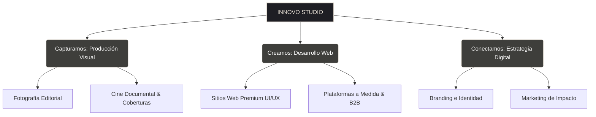

# ✦ Propuesta de Identidad, Propósito y Estrategia de Contenidos — Innovo Studio

Este documento sirve como la **piedra angular y guía creativa** para **Innovo Studio**. Define la personalidad de la marca, su propósito fundamental, pilares estratégicos y proporciona la estructura y los textos sugeridos (copywriting premium) para las páginas que actualmente tienes en blanco (`servicios.html`, `historias.html` y `contacto.html`).

---

## 1. El Concepto Innovo Studio: "Donde el Arte Coexiste con el Código"

> [!NOTE]
> **Innovo Studio** no es otra agencia digital genérica. Es un **estudio híbrido boutique** que se posiciona en un territorio muy exclusivo: la intersección perfecta entre la **emoción del arte visual** (fotografía editorial, video de autor, cine documental) y la **precisión de la ingeniería digital** (desarrollo web a medida, alto rendimiento y UX sofisticada).

### El Posicionamiento Lima-Ica
Operando entre la sofisticación corporativa de **Lima** y la riqueza cultural, natural y de eventos premium de **Ica** (haciendas históricas, viñedos de pisco, dunas en Huacachina, bodas boutique), Innovo Studio ofrece a negocios y personas una calidad estética de nivel internacional aplicada con calidez y cercanía local.

---

## 2. Propósito, Misión y Visión

### ✦ El Propósito (El "Por qué")
> *"Existimos para dar permanencia a lo efímero y claridad a lo complejo."*
Creemos que cada gran negocio tiene una obra de arte en su núcleo y que cada momento humano trascendente merece ser inmortalizado con una sensibilidad cinematográfica. No solo entregamos archivos; creamos legados visuales y digitales.

### ✦ La Misión (El "Cómo")
Empoderar a marcas y personas diseñando **plataformas web interactivas** que cautivan y convierten, y produciendo **narrativas visuales** que evocan emociones profundas, asegurando que cada punto de contacto respire arte, sofisticación y precisión técnica.

### ✦ La Visión (El "Hacia dónde")
Convertirnos en el estudio creativo boutique referente del Perú, reconocido por difuminar la línea entre el diseño de software y la producción cinematográfica, demostrando que la lógica y la emoción son las dos caras de una misma experiencia memorable.

---

## 3. Los Tres Pilares de Identidad
El slogan actual de tu sitio, **"Creamos. Capturamos. Conectamos."**, define perfectamente tus pilares:

| Pilar | Concepto | Manifestación |
| :--- | :--- | :--- |
| **CREAMOS** | *Ingeniería Web Interactiva* | Sitios web rápidos, diseñados al píxel, tipografía editorial sublime (`TT Berlinerins` y `TT Interphases Pro`), animaciones fluidas y código robusto. |
| **CAPTURAMOS** | *Storytelling de Autor* | Fotografía y cinematografía de bodas, eventos corporativos y documentales de marca que no se sienten posados, sino vivos y orgánicos. |
| **CONECTAMOS** | *Estrategia y Sentido* | Branding con concepto profundo, posicionamiento orgánico (SEO) y marketing que habla de humano a humano. |

---

## 4. Personalidad y Tono de Voz (Tone of Voice)

Para alinearse con el diseño premium de tu landing page (cursor personalizado, diseño minimalista oscuro, tipografías distinguidas), la voz de la marca debe sonar:
1. **Artística y Sofisticada**: Hablamos con poesía sutil, sin caer en la pomposidad. Evitamos la jerga corporativa aburrida y fría.
2. **Cercana y Auténtica**: Creemos en la empatía. Escuchamos activamente antes de disparar el lente o escribir la primera línea de código.
3. **Segura y Confiable**: Demostramos dominio técnico de forma humilde pero asertiva.

### Ejemplos de Contraste
*   ❌ *Tono Común:* "Hacemos páginas web con Wordpress y tomamos fotos profesionales para tu boda o empresa a buen precio."
*   ✨ *Tono Innovo Studio:* "Elevamos tu marca y tus memorias más valiosas a través de interfaces interactivas a medida y narrativas visuales de autor. Creamos piezas que no solo se ven; se quedan grabadas."

---

## 5. Estrategia de Contenido para las Páginas Vacías

A continuación, tienes las propuestas de arquitectura de información y textos (copywriting) listos para que los programes en tus páginas en blanco:

### 📄 SERVICIOS (`servicios.html`)
*Esta página debe profundizar en el portafolio técnico y visual de Innovo, detallando qué incluye cada rama.*

- **Hero de Servicios**: Título imponente con tipografía `TT Berlinerins`. E.g., *"Nuestras Disciplinas"*.
- **Servicio 1: Producción Visual (El Arte del Lente)**:
  - Cobertura Cinematográfica de Eventos & Bodas.
  - Retrato Editorial y Corporativo.
  - Documentales de Marca (Brand Films).
- **Servicio 2: Ingeniería Web & Interactividad (El Código del Arte)**:
  - Sitios Web Corporativos Premium.
  - E-commerce & Plataformas B2B (E.g., el caso AutoGas).
  - Optimización de Performance, SEO & UX/UI.
- **Servicio 3: Identidad y Estrategia (La Mente Detrás)**:
  - Diseño de Logotipos y Brandbooks.
  - Estrategia de Posicionamiento Digital.

#### ✍️ Copywriting Sugerido para Servicios
**H1 - Hero**: *"Moldeamos ideas en formas digitales y visuales."*
**Subtítulo**: *"No fabricamos en serie; diseñamos y filmamos a medida. Cada píxel y cada fotograma es trabajado bajo una curaduría obsesiva."*

**Servicio Web**: *"Sitios web que se leen como revistas de arte y funcionan con la precisión de un reloj suizo. Priorizamos la velocidad, la usabilidad móvil y el diseño que impone respeto."*
**Servicio Audiovisual**: *"Documentamos la verdad, la risa y el prestigio. Sea una boda en los viñedos de Ica o el lanzamiento de una marca en Lima, capturamos la atmósfera real con luz natural y estética editorial."*

---

### 📄 HISTORIAS (`historias.html`)
*En lugar de llamarlo "Portafolio" o "Trabajos", "Historias" le da un tono humano y editorial. Cada caso de estudio debe leerse como una crónica.*

> [!TIP]
> Te sugiero incluir tres tipos de historias clave basadas en tus proyectos reales y los placeholders de tu index:
> 1. **La historia corporativa interactiva: El caso AutoGas**
>    - *Concepto:* Cómo transformamos un sistema complejo de base de datos en una plataforma B2B rápida, intuitiva y estéticamente impecable.
> 2. **La historia humana y de paisaje: Romance en el Desierto**
>    - *Concepto:* Cobertura fotográfica y de video cinematográfico para una boda destino en las dunas de la Huacachina, Ica. Enfocado en la luz del atardecer, la elegancia y la emoción pura.
> 3. **La historia de identidad: El Renacer de una Marca Local**
>    - *Concepto:* Rediseño integral de branding e identidad visual para una bodega boutique de Pisco artesanal en Ica, elevando su empaque y su narrativa para el mercado internacional.

---

### 📄 CONTACTO (`contacto.html`)
*Esta página debe ser limpia, elegante, e invitar a la conversación, no solo a llenar un formulario estéril.*

*   **Copy Principal**: *"Cuéntanos tu visión. Estamos listos para co-crear."*
*   **Texto de Invitación**: *"¿Tienes una fecha especial en Ica o un proyecto tecnológico en Lima? Escríbenos. Nos tomamos el tiempo de entender la escala, el tono y los objetivos de tu idea."*
*   **Campos Sugeridos para un Formulario Premium**:
    1.  *¿Cómo te llamas?*
    2.  *¿Qué historia vamos a contar?* (Opciones: [ ] Una boda / Evento memorable, [ ] Un sitio web / Plataforma digital, [ ] Una campaña / Identidad de marca).
    3.  *Cuéntanos un poco más sobre el proyecto...*
    4.  *¿Cuál es tu canal de contacto preferido?* (Correo, WhatsApp o llamada).

---

## 6. Próximos Pasos para tu Código

Cuando estés listo para desarrollar estas páginas, recuerda mantener la **coherencia visual** que ya lograste en `inicio.html`:
1.  **Reutilizar el Header y Footer**: Asegúrate de copiar la misma estructura del navbar y footer en cada subpágina para que la navegación sea fluida y profesional.
2.  **Mantener el Cursor Personalizado**: El script del cursor del index debe cargarse en todas las páginas para dar esa sensación interactiva unificada.
3.  **Utilizar las Variables de CSS**: En `inicio.css` debes tener definidos tus colores (los tonos crema, oscuros y acentos refinados) y las fuentes TT Berlinerins / TT Interphases. Úsalos en los CSS de las subpáginas para garantizar consistencia absoluta.
